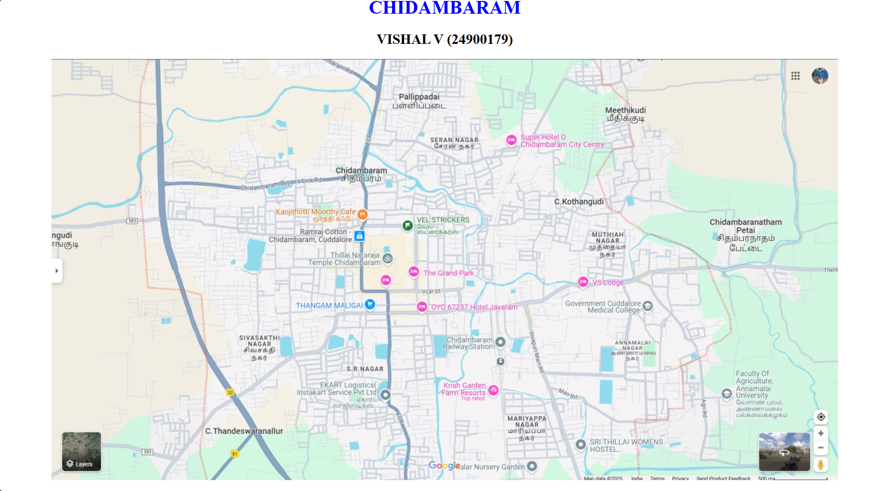
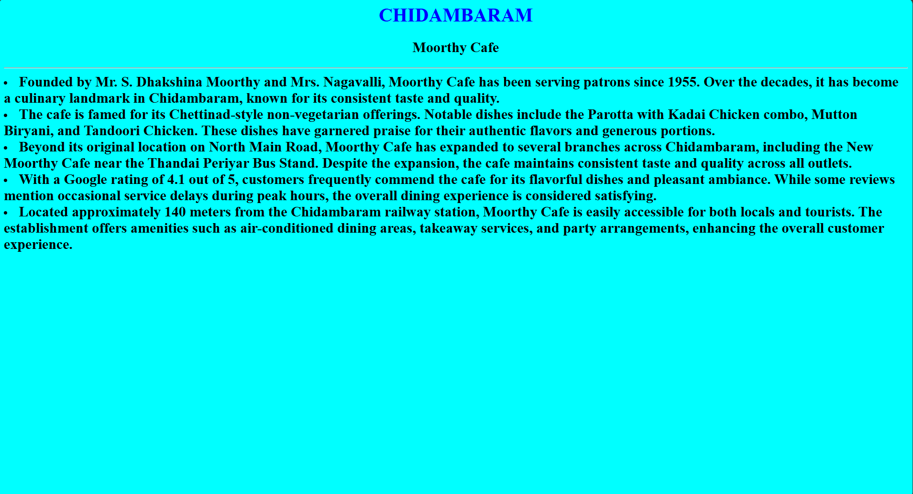
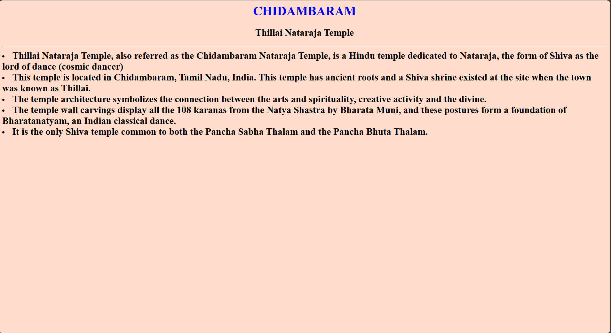
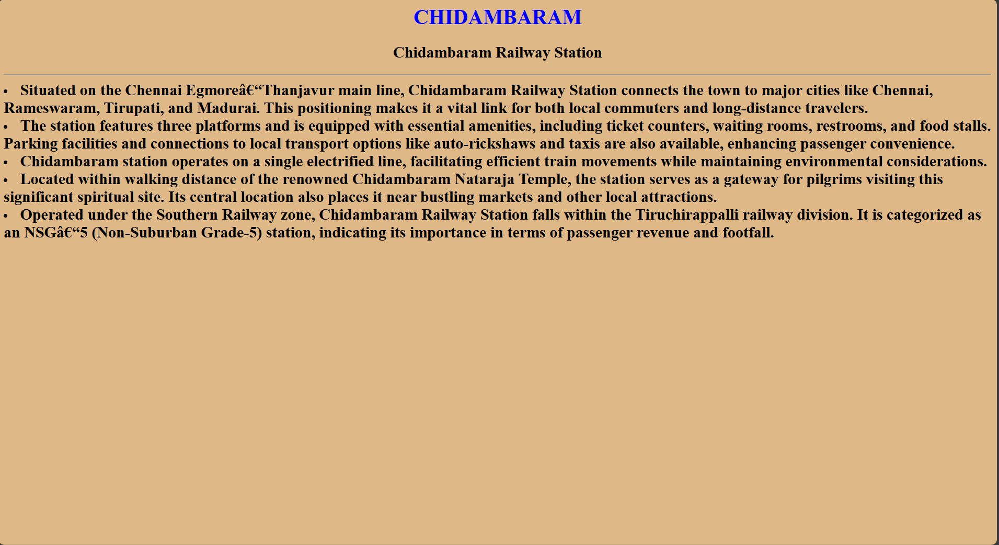
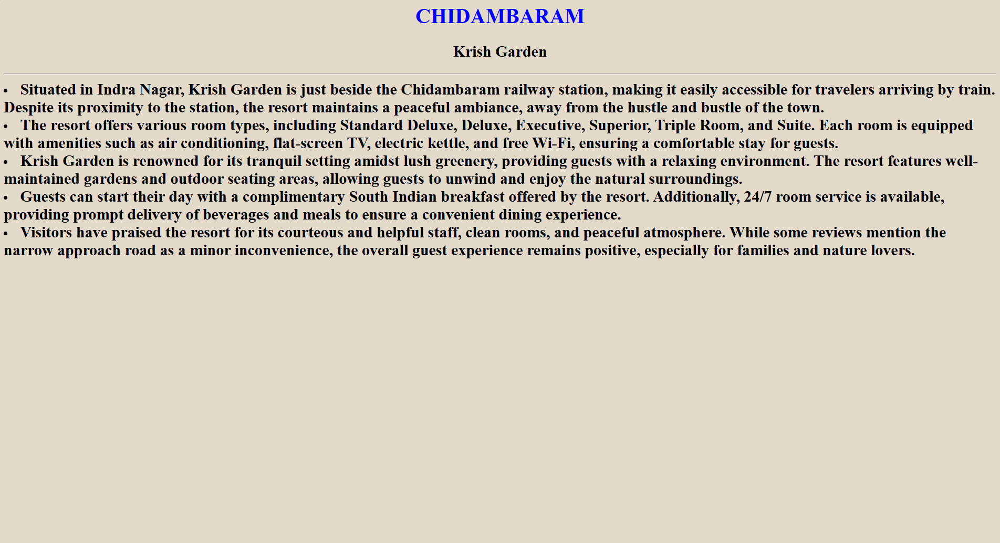
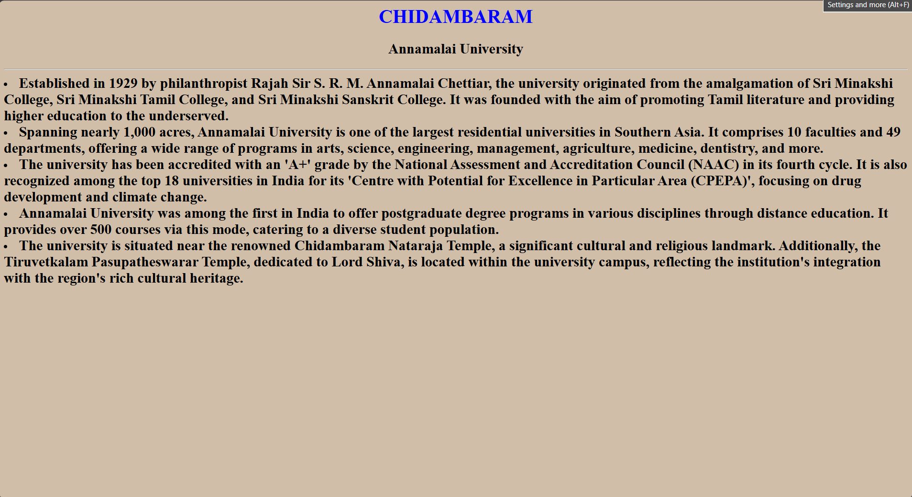

# Ex04 Places Around Me
## Date: 23-04-2025

## AIM
To develop a website to display details about the places around my house.

## DESIGN STEPS

### STEP 1
Create a Django admin interface.

### STEP 2
Download your city map from Google.

### STEP 3
Using ```<map>``` tag name the map.

### STEP 4
Create clickable regions in the image using ```<area>``` tag.

### STEP 5
Write HTML programs for all the regions identified.

### STEP 6
Execute the programs and publish them.

## CODE
```
<html>

<body>
    <h1 align="center">
        <font color="blue"><b>CHIDAMBARAM</b></font>
    </h1>
    <h2 align="center">
        <b>
            VISHAL V (24900179)
        </b>
    </h2>
    <h3 align="center">
        

        <map name="image-map">
            <area target="" alt="Thillai Nataraja temple" title="Thillai Nataraja temple" href="temple.html"
                coords="433,323,593,355" shape="rect">
            <area target="" alt="Moorthy cafe" title="Moorthy cafe" href="hotel.html" coords="376,248,543,279"
                shape="rect">
            <area target="" alt="Chidambaram Railway Station" title="Chidambaram Railway Station" href="railway.html"
                coords="659,468,771,494" shape="rect">
            <area target="" alt="Annamalai University" title="Annamalai University" href="agri.html"
                coords="1127,525,1259,613" shape="rect">
            <area target="" alt="Krish Garden" title="Krish Garden" href="garden.html" coords="656,544,756,585"
                shape="rect">
        </map>

    </h3>
</body>

</html>

temple.html

<html>

<body bgcolor="#ffddca">
    <h1 align="center">
        <font color="blue">
            CHIDAMBARAM
        </font>
    </h1>
    <h2 align="center">
        Thillai Nataraja Temple
    </h2>
    <h3>
        <hr>
        <li>
            <font size="5">
                Thillai Nataraja Temple, also referred as the Chidambaram Nataraja Temple, is a Hindu temple dedicated
                to Nataraja, the form of Shiva as the lord of dance (cosmic dancer)
            </font>
        </li>
        <li>
            <font size="5">
                This temple is located in Chidambaram, Tamil Nadu, India. This temple has ancient roots and a Shiva
                shrine existed at the site when the town was known as Thillai.
            </font>
        </li>
        <li>
            <font size="5">
                The temple architecture symbolizes the connection between the arts and spirituality, creative activity
                and the divine.
            </font>
        </li>
        <li>
            <font size="5">
                The temple wall carvings display all the 108 karanas from the Natya Shastra by Bharata Muni, and these
                postures form a foundation of Bharatanatyam, an Indian classical dance.
            </font>
        </li>
        </font>
        </li>
        <li>
            <font size="5">
                It is the only Shiva temple common to both the Pancha Sabha Thalam and the Pancha Bhuta Thalam.
            </font>
        </li>
    </h3>

</body>

</html>

hotel.html

<html>

<body bgcolor="#00ffff">
    <h1 align="center">
        <font color="blue">
            CHIDAMBARAM
        </font>
    </h1>
    <h2 align="center">
        Moorthy Cafe
    </h2>
    <h3>
        <hr>
        <li>
            <font size="5">
                Founded by Mr. S. Dhakshina Moorthy and Mrs. Nagavalli, Moorthy Cafe has been serving patrons since 1955. Over the decades, it has become a culinary landmark in Chidambaram, known for its consistent taste and quality.
            </font>
        </li>
        <li>
            <font size="5">

                The cafe is famed for its Chettinad-style non-vegetarian offerings. Notable dishes include the Parotta with Kadai Chicken combo, Mutton Biryani, and Tandoori Chicken. These dishes have garnered praise for their authentic flavors and generous portions.
            </font>
        </li>
        <li>
            <font size="5">
                Beyond its original location on North Main Road, Moorthy Cafe has expanded to several branches across Chidambaram, including the New Moorthy Cafe near the Thandai Periyar Bus Stand. Despite the expansion, the cafe maintains consistent taste and quality across all outlets.
            </font>
        </li>
        <li>
            <font size="5">
                With a Google rating of 4.1 out of 5, customers frequently commend the cafe for its flavorful dishes and pleasant ambiance. While some reviews mention occasional service delays during peak hours, the overall dining experience is considered satisfying.
            </font>
        </li>
        </font>
        </li>
        <li>
            <font size="5">
                Located approximately 140 meters from the Chidambaram railway station, Moorthy Cafe is easily accessible for both locals and tourists. The establishment offers amenities such as air-conditioned dining areas, takeaway services, and party arrangements, enhancing the overall customer experience.
            </font>
        </li>
    </h3>

</body>

</html>

railway.html

<html>

<body bgcolor="#deb887">
    <h1 align="center">
        <font color="blue">
            CHIDAMBARAM
        </font>
    </h1>
    <h2 align="center">
        Chidambaram Railway Station
    </h2>
    <h3>
        <hr>
        <li>
            <font size="5">
                Situated on the Chennai Egmore–Thanjavur main line, Chidambaram Railway Station connects the town to major cities like Chennai, Rameswaram, Tirupati, and Madurai. This positioning makes it a vital link for both local commuters and long-distance travelers.
            </font>
        </li>
        <li>
            <font size="5">
                The station features three platforms and is equipped with essential amenities, including ticket counters, waiting rooms, restrooms, and food stalls. Parking facilities and connections to local transport options like auto-rickshaws and taxis are also available, enhancing passenger convenience.
            </font>
        </li>
        <li>
            <font size="5">
                Chidambaram station operates on a single electrified line, facilitating efficient train movements while maintaining environmental considerations.
            </font>
        </li>
        <li>
            <font size="5">
                Located within walking distance of the renowned Chidambaram Nataraja Temple, the station serves as a gateway for pilgrims visiting this significant spiritual site. Its central location also places it near bustling markets and other local attractions.
            </font>
        </li>
        </font>
        </li>
        <li>
            <font size="5">
                Operated under the Southern Railway zone, Chidambaram Railway Station falls within the Tiruchirappalli railway division. It is categorized as an NSG–5 (Non-Suburban Grade-5) station, indicating its importance in terms of passenger revenue and footfall.
            </font>
        </li>
    </h3>

</body>

</html>

agri.html

<html>

<body bgcolor="#d1bea8">
    <h1 align="center">
        <font color="blue">
            CHIDAMBARAM
        </font>
    </h1>
    <h2 align="center">
        Annamalai University
    </h2>
    <h3>
        <hr>
        <li>
            <font size="5">
                Established in 1929 by philanthropist Rajah Sir S. R. M. Annamalai Chettiar, the university originated from the amalgamation of Sri Minakshi College, Sri Minakshi Tamil College, and Sri Minakshi Sanskrit College. It was founded with the aim of promoting Tamil literature and providing higher education to the underserved.
            </font>
        </li>
        <li>
            <font size="5">
                Spanning nearly 1,000 acres, Annamalai University is one of the largest residential universities in Southern Asia. It comprises 10 faculties and 49 departments, offering a wide range of programs in arts, science, engineering, management, agriculture, medicine, dentistry, and more.
            </font>
        </li>
        <li>
            <font size="5">
                The university has been accredited with an 'A+' grade by the National Assessment and Accreditation Council (NAAC) in its fourth cycle. It is also recognized among the top 18 universities in India for its 'Centre with Potential for Excellence in Particular Area (CPEPA)', focusing on drug development and climate change.

            </font>
        </li>
        <li>
            <font size="5">
                Annamalai University was among the first in India to offer postgraduate degree programs in various disciplines through distance education. It provides over 500 courses via this mode, catering to a diverse student population.
            </font>
        </li>
        </font>
        </li>
        <li>
            <font size="5">
                The university is situated near the renowned Chidambaram Nataraja Temple, a significant cultural and religious landmark. Additionally, the Tiruvetkalam Pasupatheswarar Temple, dedicated to Lord Shiva, is located within the university campus, reflecting the institution's integration with the region's rich cultural heritage.
            </font>
        </li>
    </h3>

</body>

</html>

<html>

<body bgcolor="#e3dac9">
    <h1 align="center">
        <font color="blue">
            CHIDAMBARAM
        </font>
    </h1>
    <h2 align="center">
        Krish Garden
    </h2>
    <h3>
        <hr>
        <li>
            <font size="5">
                Situated in Indra Nagar, Krish Garden is just beside the Chidambaram railway station, making it easily accessible for travelers arriving by train. Despite its proximity to the station, the resort maintains a peaceful ambiance, away from the hustle and bustle of the town.
            </font>
        </li>
        <li>
            <font size="5">
                The resort offers various room types, including Standard Deluxe, Deluxe, Executive, Superior, Triple Room, and Suite. Each room is equipped with amenities such as air conditioning, flat-screen TV, electric kettle, and free Wi-Fi, ensuring a comfortable stay for guests.            </font>
        </li>
        <li>
            <font size="5">
                Krish Garden is renowned for its tranquil setting amidst lush greenery, providing guests with a relaxing environment. The resort features well-maintained gardens and outdoor seating areas, allowing guests to unwind and enjoy the natural surroundings.
            </font>
        </li>
        <li>
            <font size="5">
                Guests can start their day with a complimentary South Indian breakfast offered by the resort. Additionally, 24/7 room service is available, providing prompt delivery of beverages and meals to ensure a convenient dining experience.            </font>
        </li>
        </font>
        </li>
        <li>
            <font size="5">
                Visitors have praised the resort for its courteous and helpful staff, clean rooms, and peaceful atmosphere. While some reviews mention the narrow approach road as a minor inconvenience, the overall guest experience remains positive, especially for families and nature lovers.            </font>
        </li>
    </h3>

</body>

</html>
```

## OUTPUT








## RESULT
The program for implementing image maps using HTML is executed successfully.
